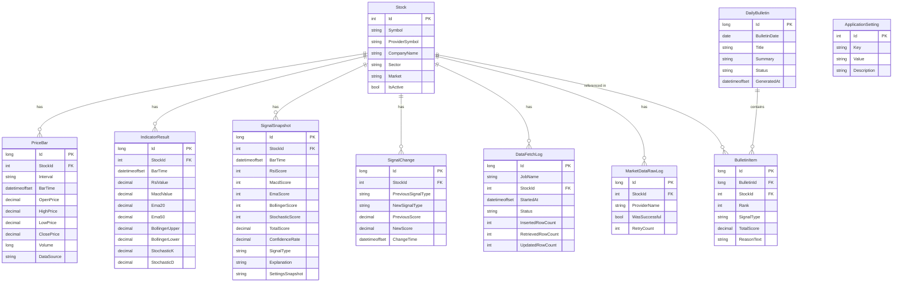
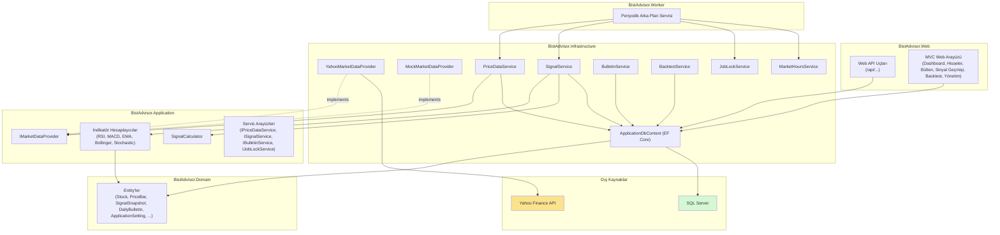

# BistAdvisor

BIST (Borsa İstanbul) hisseleri için teknik analiz, al-sat sinyali üretimi ve otomatik günlük bülten oluşturan web tabanlı bir platform.

> **Yasal Uyarı:** Bu proje eğitim/staj amaçlı geliştirilmiştir. Burada yer alan bilgiler yatırım danışmanlığı kapsamında değildir ve gerçek yatırım kararları için kullanılmamalıdır.

---

## İçindekiler

- [Genel Bakış](#genel-bakış)
- [Özellikler](#özellikler)
- [Teknoloji Yığını](#teknoloji-yığını)
- [Mimari](#mimari)
- [Veritabanı Şeması (ER Diyagramı)](#veritabanı-şeması-er-diyagramı)
- [Mimari Diyagramı](#mimari-diyagramı)
- [Kurulum](#kurulum)
- [Çalıştırma](#çalıştırma)
- [Docker ile Çalıştırma](#docker-ile-çalıştırma)
- [API Uç Noktaları](#api-uç-noktaları)
- [Postman Koleksiyonu](#postman-koleksiyonu)
- [Web Arayüzü](#web-arayüzü)
- [Testler](#testler)
- [Bilinen Sınırlamalar](#bilinen-sınırlamalar)
- [Proje Kapsamı Dışında Bırakılanlar](#proje-kapsamı-dışında-bırakılanlar)

---

## Genel Bakış

BistAdvisor, BIST 100 endeksindeki 100 hissenin günlük fiyat verilerini otomatik olarak toplar, beş teknik indikatör (RSI, MACD, EMA20/EMA50, Bollinger Bantları, Stochastic Oscillator) üzerinden ağırlıklı bir puanlama yaparak **Güçlü Al / Al / Nötr / Sat / Güçlü Sat** sınıflandırması üretir ve bu sonuçları hem bir web arayüzünde hem de otomatik oluşturulan günlük bültenlerde sunar.

Sistem, bir arka plan servisi aracılığıyla periyodik olarak (varsayılan 15 dakikada bir, ayarlardan değiştirilebilir) tüm hisseleri güncelleyip yeniden analiz eder; herhangi bir manuel müdahale gerektirmez.

## Özellikler

- **Gerçek piyasa verisi**: Yahoo Finance üzerinden BIST hisselerinin güncel/geçmiş fiyat verileri; geliştirme/test amaçlı sahte (mock) veri sağlayıcısı ile anında değiştirilebilir mimari
- **5 teknik indikatör**: RSI(14), MACD(12,26,9), EMA(20/50), Bollinger Bantları(20,2), Stochastic Oscillator(14,3) — periyotlar sistem ayarlarından yapılandırılabilir
- **Ağırlıklı sinyal skorlama**: -100 ile +100 arası teknik skor; uyum oranı, veri güncelliği ve gerçek işlem hacmi doğrulamasını birleştiren güven oranı hesaplaması; gerekçeli açıklama metni (Türkçe)
- **Dört ayrı veri kalitesi durumu**: Yetersiz Veri, Güncel Olmayan Veri, Veri Alınamadı, Hesaplama Hatası — sinyal üretimi bu durumlarda güvenli şekilde engellenir
- **Sinyal değişikliği takibi**: Bir hissenin sinyali değiştiğinde otomatik kayıt ve tarihçe
- **Algoritma versiyonlama**: Her sinyal kaydı, o an kullanılan ağırlık/eşik değerlerinin anlık görüntüsünü (snapshot) JSON olarak saklar
- **Otomatik arka plan servisi**: Periyodik veri toplama ve sinyal hesaplama; hata izolasyonu (bir hissedeki hata diğerlerini etkilemez); artan bekleme süreli (exponential backoff) yeniden deneme mekanizması
- **BIST işlem saatleri farkındalığı**: Türkiye saat dilimine göre piyasa açık/kapalı durumu takip edilir ve Yönetim panelinde görüntülenir
- **İş eşzamanlılık koruması**: Veritabanı destekli kilit mekanizması, Worker ve Yönetim panelinden aynı anda tetiklenen senkronizasyon işlemlerinin çakışmasını engeller
- **Günlük bülten**: Sinyali değişen hisseleri gerekçeleriyle listeleyen, otomatik üretilen bülten; aynı gün için tekrar oluşturmada eski bülten silinmeyip revize durumuna alınır; hisse kodu/sinyal tipi/minimum skora göre filtrelenebilir; sadece bültenin bulunduğu günlerin seçilebildiği özel bir takvim bileşeni
- **Web arayüzü**: Dashboard, filtrelenebilir/sıralanabilir/sayfalanan hisse listesi, tam indikatör grafikli (mum grafiği, EMA/Bollinger, RSI, MACD, Stochastic) hisse detay sayfası, sinyal geçmişi, günlük bülten, geriye dönük test (backtest) ve şifre korumalı yönetim paneli
- **REST API**: 13 uç nokta ile hisse, fiyat, indikatör, sinyal, bülten ve iş verilerine sayfalama/filtrelemeyle erişim; Swagger dokümantasyonu ve hazır Postman koleksiyonu
- **Yönetim paneli**: Kullanıcı adı/şifre korumalı, gezinme menüsünde bağlantısı gösterilmeyen (yalnızca doğrudan adresle erişilen) gizli panel; manuel veri toplama/bülten oluşturma tetikleme (asenkron, geri bildirimli), hisse aktif/pasif yönetimi, sistem ayarları görüntüleme, iş takip logları, piyasa durumu, veri kaynağı bağlantı testi
- **Geriye dönük test (backtest)**: Geçmiş sinyal verilerine dayalı basitleştirilmiş al-sat simülasyonu; toplam işlem, kazanma oranı, ortalama/toplam getiri özeti
- **Container'laştırma**: Docker ve Docker Compose ile Web, Worker ve SQL Server'ı tek komutla ayağa kaldırma desteği
- **Yapılandırılmış loglama**: Serilog ile hem konsola hem günlük olarak dönen dosyalara (14 gün saklama) loglama
- **Kapsamlı test paketi**: 57 birim ve entegrasyon testi (indikatör hesaplama, puanlama, veri senkronizasyonu, sinyal üretimi, yeniden deneme mekanizması, hata izolasyonu, bülten kuralları, API filtreleme/sayfalama)

## Teknoloji Yığını

| Katman | Teknoloji |
|---|---|
| Backend | ASP.NET Core 8 (Web API + MVC) |
| ORM | Entity Framework Core 8 |
| Veritabanı | Microsoft SQL Server |
| Frontend | Bootstrap 5, Chart.js (+ finansal mum grafiği eklentisi), özel tasarım bileşenleri (combobox, animasyonlu input, takvim), vanilla JavaScript (fetch/AJAX) |
| Arka plan işleri | .NET `BackgroundService` |
| Piyasa verisi | Yahoo Finance (`OoplesFinance.YahooFinanceAPI`) |
| Loglama | Serilog (konsol + dönen dosya) |
| Kimlik doğrulama | Çerez tabanlı, kullanıcı adı/şifre korumalı yönetim paneli girişi |
| Container'laştırma | Docker, Docker Compose |
| Test | xUnit, EF Core InMemory, `Microsoft.AspNetCore.Mvc.Testing` |
| API dokümantasyonu | Swagger / OpenAPI, Postman koleksiyonu |

## Mimari

Proje, katmanlı (layered) bir mimariyle, altı ayrı .NET projesinden oluşur:

```
BistAdvisor.sln
├── BistAdvisor.Domain          → Entity'ler, enum'lar (Stock, PriceBar, SignalSnapshot, DailyBulletin, ApplicationSetting, ...)
├── BistAdvisor.Application     → Servis arayüzleri, iş mantığı (indikatör hesaplama, sinyal puanlama, DTO'lar)
├── BistAdvisor.Infrastructure  → EF Core DbContext, veri sağlayıcı implementasyonları, servis implementasyonları (Signal, Bulletin, Price, JobLock, MarketHours, Backtest)
├── BistAdvisor.Worker          → Periyodik veri toplama ve sinyal hesaplama (arka plan servisi)
├── BistAdvisor.Web             → Web API uç noktaları + MVC web arayüzü
└── BistAdvisor.Tests           → xUnit birim ve entegrasyon testleri
```

**Bağımlılık yönü:** `Domain` ← `Application` ← `Infrastructure` ← `Web` / `Worker`

Veri kaynağı, `IMarketDataProvider` arayüzü üzerinden soyutlanmıştır — şu anki implementasyon Yahoo Finance kullanır (`YahooMarketDataProvider`); geliştirme/test amaçlı bir `MockMarketDataProvider` da mevcuttur. Veri kaynağı, `Program.cs` içindeki tek bir bağımlılık enjeksiyonu kaydı değiştirilerek anında değiştirilebilir.

İndikatör periyotları, sinyal ağırlıkları/eşik değerleri ve Worker'ın veri toplama aralığı, kod içinde sabit değerler olarak değil, `ApplicationSettings` veritabanı tablosundan okunur; bu sayede sistem davranışı kod değişikliği ve yeniden derleme gerektirmeden ayarlanabilir.

`Web` ve `Worker` projeleri, üretim ortamındaki dağıtımı yansıtacak şekilde birbirinden bağımsız iki ayrı süreç (process) olarak çalışır; ikisi de aynı veritabanına bağlanır ve veritabanı destekli bir kilit mekanizmasıyla senkronize çalışır.

## Veritabanı Şeması (ER Diyagramı)



## Mimari Diyagramı



## Kurulum

### Gereksinimler

- [.NET 8 SDK](https://dotnet.microsoft.com/download/dotnet/8.0)
- SQL Server (Developer/Express sürümü veya Docker container — bkz. [Docker ile Çalıştırma](#docker-ile-çalıştırma))
- (Önerilir) JetBrains Rider veya Visual Studio 2022

### Adımlar

1. **Depoyu klonlayın**

   ```bash
   git clone https://github.com/JustMehmettt/BistAdvisor.git
   cd BistAdvisor
   ```

2. **Veritabanı bağlantısını ve yönetim paneli kimlik bilgilerini yapılandırın**

   `BistAdvisor.Web/appsettings.example.json` dosyasını `BistAdvisor.Web/appsettings.Development.json` olarak kopyalayın ve kendi bilgilerinizi girin (`AdminUsername` belirtilmezse varsayılan olarak `admin` kullanılır):

   ```json
   {
     "AdminUsername": "admin",
     "AdminPassword": "kendi-şifreniz",
     "ConnectionStrings": {
       "DefaultConnection": "Server=localhost;Database=BistAdvisorDb_Dev;Trusted_Connection=True;TrustServerCertificate=True;"
     }
   }
   ```

   Aynı bağlantı dizesini `BistAdvisor.Worker/appsettings.json` dosyasına da girin.

   > **Not:** Yönetim paneline (`/Admin`) erişim bağlantısı gezinme menüsünde gösterilmez; panele yalnızca adresi doğrudan yazarak ve ardından kullanıcı adı/şifre ile giriş yaparak ulaşılabilir.

3. **EF Core araçlarını kurun (yoksa)**

   ```bash
   dotnet tool install --global dotnet-ef
   ```

4. **Bağımlılıkları geri yükleyin ve derleyin**

   ```bash
   dotnet restore
   dotnet build
   ```

5. **Veritabanı migration'larını uygulayın**

   ```bash
   dotnet ef database update --project BistAdvisor.Infrastructure --startup-project BistAdvisor.Web
   ```

6. **Testleri çalıştırın (isteğe bağlı ama önerilir)**

   ```bash
   dotnet test BistAdvisor.Tests
   ```

Kurulumu otomatikleştiren bir PowerShell betiği de (`setup.ps1`) proje kök dizininde mevcuttur.

## Çalıştırma

Sistem, biri veri/sinyal işleme için (Worker), diğeri web arayüzü ve API için (Web) olmak üzere **iki ayrı süreç** olarak çalıştırılmalıdır.

### 1. Web uygulamasını başlatın

```bash
dotnet run --project BistAdvisor.Web
```

İlk çalıştırmada, veritabanı boşsa BIST 100 hisseleri ve varsayılan sistem ayarları otomatik olarak eklenir (seed). Uygulama varsayılan olarak `http://localhost:5010` adresinde çalışır (port farklıysa konsol çıktısını kontrol edin).

- Web arayüzü: `http://localhost:5010/`
- Swagger API dokümantasyonu: `http://localhost:5010/swagger`
- Yönetim paneli (kullanıcı adı/şifre korumalı, gezinme menüsünde bağlantısı yoktur): `http://localhost:5010/Admin`

### 2. Arka plan servisini başlatın (ayrı bir terminalde)

```bash
dotnet run --project BistAdvisor.Worker
```

Worker, başlangıçta ve ardından yapılandırılan aralıkla (varsayılan 15 dakika), tüm aktif hisseler için fiyat verisini günceller ve sinyal hesaplar. BIST işlem saatleri dışında da senkronizasyona devam eder (geçmiş verinin tamamlanması için), ancak bunu bilgilendirici bir log ile belirtir.

> **Not:** Worker'ı hiç çalıştırmadan da web arayüzünü/API'yi kullanabilirsiniz — ancak yeni veri, Yönetim panelinden manuel tetikleme yapılmadığı sürece sisteme girmez.

## Docker ile Çalıştırma

Sistem, Docker Compose kullanılarak SQL Server dahil tüm bileşenleriyle (Web, Worker, veritabanı) container'lar halinde çalıştırılabilir.

### Gereksinimler

- [Docker Desktop](https://www.docker.com/products/docker-desktop/) (WSL 2 tabanlı, Windows için)

### Çalıştırma

1. **SQL Server container'ını başlatın**

   ```bash
   docker-compose up -d sqlserver
   ```

   SQL Server "healthy" duruma geçtikten sonra (`docker-compose ps` ile kontrol edilebilir), migration'ları container'daki veritabanına uygulayın:

   ```bash
   dotnet ef database update --project BistAdvisor.Infrastructure --startup-project BistAdvisor.Web --connection "Server=localhost,14330;Database=BistAdvisorDb;User Id=sa;Password=YourStrong!Passw0rd;TrustServerCertificate=True;Encrypt=False;"
   ```

2. **Tüm sistemi (Web + Worker) build edip başlatın**

   ```bash
   docker-compose up -d --build
   ```

3. **Durumu kontrol edin**

   ```bash
   docker-compose ps
   docker-compose logs web --tail 20
   docker-compose logs worker --tail 20
   ```

4. Web arayüzüne `http://localhost:5010` adresinden erişebilirsiniz.

### Önemli Notlar

- **Port çakışması**: Eğer bilgisayarınızda zaten yerel bir SQL Server çalışıyorsa (varsayılan port 1433'ü kullanıyorsa), `docker-compose.yml` dosyasındaki SQL Server portu, host tarafında `14330:1433` olarak farklı bir porta haritalanmıştır; container'lar arası iletişim (Web/Worker'dan SQL Server'a) her zaman iç ağ üzerinden, standart 1433 portuyla gerçekleşir.
- **Güvenlik**: `docker-compose.yml` dosyasındaki `SA_PASSWORD` ve `AdminPassword` değerleri yalnızca yerel geliştirme/deneme amaçlıdır ve bu haliyle gerçek bir ortamda kullanılmamalıdır. Üretim ortamı için bu değerlerin Docker secrets, ortam değişkenleri veya bir gizli bilgi yönetim servisi (örn. Azure Key Vault) üzerinden sağlanması önerilir.
- **Veri kalıcılığı**: SQL Server verileri `sqlserver-data` adlı bir Docker volume'unda saklanır; `docker-compose down` komutu bu veriyi silmez, ancak `docker-compose down -v` komutu **volume'ları da siler** ve veritabanını sıfırlar.
- **Ayarları değiştirme**: `docker-compose.yml` içindeki `environment` bölümünde bir değer değiştirildiğinde, ilgili servisin yeniden build edilmesine gerek yoktur; `docker-compose up -d <servis-adı>` komutu container'ı güncel tanımla yeniden oluşturur.

## API Uç Noktaları

| Metot | Uç Nokta | Açıklama |
|---|---|---|
| GET | `/api/stocks` | Hisse listesi (sayfalama, sektör filtresi) |
| GET | `/api/stocks/{symbol}` | Tek bir hissenin detayı |
| GET | `/api/stocks/{symbol}/prices` | Hisseye ait fiyat geçmişi (sayfalı) |
| GET | `/api/stocks/{symbol}/indicators` | Hisseye ait hesaplanan indikatör geçmişi (sayfalı) |
| GET | `/api/stocks/{symbol}/signals` | Bir hisseye ait sinyal geçmişi |
| GET | `/api/signals/latest` | Tüm hisselerin en güncel sinyalleri (sinyal türüne göre filtrelenebilir) |
| GET | `/api/signals/changes` | Tüm hisselerdeki sinyal değişiklikleri (hisseye göre filtrelenebilir) |
| GET | `/api/bulletins/today` | Bugünün aktif bülteni |
| GET | `/api/bulletins/{date}` | Belirli bir tarihin bülteni |
| GET | `/api/jobs` | Veri toplama işlerinin geçmişi |
| POST | `/api/jobs/data-sync` | Veri toplama işlemini manuel tetikler (iş kilidiyle korunur) |
| POST | `/api/jobs/generate-bulletin` | Günlük bülteni manuel oluşturur |
| GET | `/api/system/data-health` | Sistem veri sağlığı özeti (aktif/güncel hisse sayısı, son senkronizasyon, hata sayısı) |

Tam, interaktif dokümantasyon için uygulama çalışırken `/swagger` adresini ziyaret edin. API'nin sistemsel hata/durum mesajları, uluslararası entegrasyon kolaylığı gözetilerek İngilizce sunulmaktadır.

## Postman Koleksiyonu

Proje kök dizinindeki `BistAdvisor.postman_collection.json` dosyası, yukarıdaki 13 API uç noktasının tamamını kategorilere ayrılmış (Stocks, Signals, Bulletins, Jobs, System) hazır isteklerle içerir. Postman'e **Import** ile eklenip `baseUrl` değişkeni kendi ortamınıza göre ayarlanarak doğrudan kullanılabilir.

## Web Arayüzü

| Sayfa | Yol | Açıklama |
|---|---|---|
| Dashboard | `/` | Sinyal dağılım özeti, en yüksek/düşük skorlu 5 hisse, son sinyal değişiklikleri, veri toplama durumu, bugünün bültenine erişim |
| Hisse Listesi | `/Stocks` | Filtrelenebilir (sektör, sinyal tipi, min. skor, min. güven oranı, güncel olmayanları gizleme), sıralanabilir, sayfalanan hisse tablosu |
| Hisse Detay | `/Stocks/Detail/{symbol}` | Mum grafiği, EMA/Bollinger çizgi grafiği, RSI/MACD/Stochastic grafikleri, indikatör puan dağılım tablosu, sinyal gerekçesi, algoritma versiyonu, günlük değişim oranı, sinyal geçmişi |
| Günlük Bülten | `/Bulletin` | Sinyal türüne göre gruplanmış günlük bülten; hisse kodu/sinyal tipi/min. skor filtreleri; sadece bültenin bulunduğu günlerin seçilebildiği özel takvim |
| Sinyal Geçmişi | `/SignalHistory` | Tüm hisselerdeki sinyal değişikliklerinin genel akışı; hisse ve sinyal tipine göre filtrelenebilir |
| Backtest | `/Backtest` | Geçmiş sinyallere dayalı basitleştirilmiş al-sat simülasyonu ve performans özeti |
| Yönetim Paneli | `/Admin` | Manuel veri/bülten tetikleme, hisse yönetimi, sistem ayarları görüntüleme, iş logları, piyasa durumu, veri kaynağı bağlantı testi — kullanıcı adı/şifre korumalı, gezinme menüsünde bağlantısı gösterilmez |

## Testler

Proje, 57 birim ve entegrasyon testi içerir:

```bash
dotnet test BistAdvisor.Tests
```

Test kapsamı:

- Beş teknik indikatör hesaplayıcısının doğruluğu ve uç durum (yetersiz veri, sabit fiyat serisi) davranışları
- İndikatör puanlama kurallarının eşik değerlerinde doğru çalışması
- Ağırlıklı sinyal skorlama ve sınıflandırma mantığı
- Fiyat verisi senkronizasyonunda mükerrer kayıt engelleme (EF Core InMemory veritabanı ile)
- Yeniden deneme (retry) mekanizmasının artan bekleme süresiyle doğru çalışması ve başarısızlık durumunun loglanması
- Bir hissedeki kalıcı hatanın diğer hisselerin işlenmesini etkilemediğinin doğrulanması (hata izolasyonu)
- Sinyal anlık görüntüsü kaydı ve sinyal değişikliği tespiti
- Güncel olmayan/eksik/yetersiz veri durumlarında sinyal üretiminin güvenli şekilde engellenmesi
- Aynı gün için mükerrer aktif bülten oluşturulmasının engellenmesi ve bülten içeriğine doğru hisselerin dahil edilmesi
- API filtreleme ve sayfalamanın `WebApplicationFactory` ile uçtan uca (entegrasyon) test edilmesi

Detaylı test senaryoları ve sonuçları için `TestScenariosAndResults.md` dosyasına bakın.

## Bilinen Sınırlamalar

- **Veri kaynağı**: Yahoo Finance, resmi/lisanslı bir BIST veri sağlayıcısı değildir; veriler gecikmeli/halka açık kaynaklardan gelir. Gerçek zamanlı, lisanslı veri için Borsa İstanbul'un resmi API'si veya ticari bir veri sağlayıcısı gereklidir.
- **Hisse evreni**: Sistem, BIST 100 endeksindeki 100 hisseyle sınırlıdır; endeks dışı hisseler veya yeni halka arzlar otomatik olarak eklenmez, seed verisinin elle güncellenmesi gerekir.
- **Nadir veri boşlukları**: Bazı düşük hacimli hisselerde Yahoo Finance'in geçici veri sağlayamaması durumunda, ilgili hissenin senkronizasyonu üç denemeden sonra o döngüde başarısız olabilir (hata izolasyonu sayesinde diğer hisseler etkilenmez, `DataFetchLogs` ve `MarketDataRawLogs` tablolarında kayıt altına alınır).
- **Bellek içi filtreleme**: Hisse Listesi ve Bülten gibi bazı ekranlarda, EF Core'un karmaşık `GroupBy`+`First` sorgularını doğrudan SQL'e çeviremediği durumlar için, ilgili veriler belleğe çekilip orada filtreleniyor. Bu yaklaşım mevcut ölçekte (100 hisse) performans sorunu yaratmaz; veri hacmi önemli ölçüde büyürse veritabanı seviyesinde optimize edilmiş sorgulara geçiş değerlendirilmelidir.
- **Piyasa takvimi**: Borsa işlem saatleri kontrolü hafta içi/hafta sonu ve saat aralığına dayanır; resmi tatil günleri dikkate alınmaz.
- **İş takip kayıtlarının basitleştirilmesi**: `DataFetchLog` tablosundaki `RetrievedRowCount` alanı, veri servisinin dış arayüzü değiştirilmediği için `InsertedRowCount` ile eşit kabul edilir; `UpdatedRowCount` sistemde "güncelleme" kavramı bulunmadığından her zaman sıfırdır.
- **Backtest basitleştirmesi**: Geriye dönük test modülü komisyon, kayma (slippage) ve gerçek emir gecikmesini hesaba katmaz; yalnızca eğitim/analiz amaçlıdır.
- **Repository deseni kullanılmamıştır**: Veri erişimi, ayrı bir repository katmanı yerine servis ve controller sınıflarında doğrudan `DbContext` üzerinden yapılır. Bu, projenin mevcut ölçeğinde bilinçli bir tercihtir; test edilebilirlik ihtiyacı EF Core InMemory veritabanıyla zaten karşılanmaktadır.
- **Docker container güvenliği**: `docker-compose.yml` dosyasındaki veritabanı/yönetim paneli kimlik bilgileri yalnızca yerel geliştirme amaçlıdır; üretim dağıtımı için ayrı bir gizli bilgi yönetimi stratejisi gereklidir.

## Proje Kapsamı Dışında Bırakılanlar

Aşağıdakiler, bu projenin eğitim/staj amaçlı kapsamı dışında bırakılmıştır:

- Gerçek alım/satım emri gönderme veya herhangi bir borsa/aracı kurum hesabına bağlanma
- Otomatik/algoritmik alım-satım
- Kişiselleştirilmiş yatırım danışmanlığı
- Yapay zekâ veya otomasyon bileşenlerinin harici sistemlere, hesaplara veya sunucuya yetkisiz erişimi

Tüm veri erişimi salt okunurdur ve yalnızca açıkça tanımlanmış, yetkilendirilmiş arayüzler üzerinden gerçekleşir.