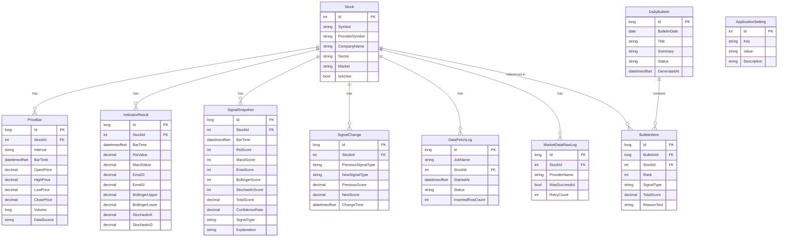
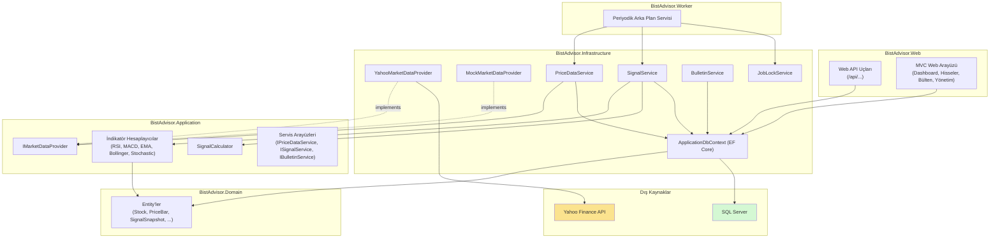

# BistAdvisor

BIST (Borsa İstanbul) hisseleri için teknik analiz, al-sat sinyali üretimi ve otomatik günlük bülten oluşturan web tabanlı bir platform.

> **Yasal Uyarı:** Bu proje eğitim/staj amaçlı geliştirilmiştir. Burada yer alan bilgiler yatırım danışmanlığı kapsamında değildir ve gerçek yatırım kararları için kullanılmamalıdır.

---

## İçindekiler

- [Genel Bakış](#genel-bakış)
- [Özellikler](#özellikler)
- [Teknoloji Yığını](#teknoloji-yığını)
- [Mimari](#mimari)
- [Kurulum](#kurulum)
- [Çalıştırma](#çalıştırma)
- [API Uç Noktaları](#api-uç-noktaları)
- [Web Arayüzü](#web-arayüzü)
- [Testler](#testler)
- [Bilinen Sınırlamalar](#bilinen-sınırlamalar)
- [Proje Kapsamı Dışında Bırakılanlar](#proje-kapsamı-dışında-bırakılanlar)

---

## Genel Bakış

BistAdvisor, BIST 100 endeksindeki 100 hissenin günlük fiyat verilerini otomatik olarak toplar, beş teknik indikatör (RSI, MACD, EMA20/EMA50, Bollinger Bantları, Stochastic Oscillator) üzerinden ağırlıklı bir puanlama yaparak **Güçlü Al / Al / Nötr / Sat / Güçlü Sat** sınıflandırması üretir ve bu sonuçları hem bir web arayüzünde hem de otomatik oluşturulan günlük bültenlerde sunar.

Sistem, bir arka plan servisi aracılığıyla periyodik olarak (varsayılan 15 dakikada bir) tüm hisseleri güncelleyip yeniden analiz eder; herhangi bir manuel müdahale gerektirmez.

## Özellikler

- **Gerçek piyasa verisi**: Yahoo Finance üzerinden BIST hisselerinin güncel/geçmiş fiyat verileri
- **5 teknik indikatör**: RSI(14), MACD(12,26,9), EMA(20/50), Bollinger Bantları(20,2), Stochastic Oscillator(14,3)
- **Ağırlıklı sinyal skorlama**: -100 ile +100 arası teknik skor, güven oranı hesaplaması, gerekçeli açıklama metni
- **Sinyal değişikliği takibi**: Bir hissenin sinyali değiştiğinde otomatik kayıt ve tarihçe
- **Otomatik arka plan servisi**: Periyodik veri toplama ve sinyal hesaplama; hata izolasyonu (bir hissedeki hata diğerlerini etkilemez)
- **Günlük bülten**: Öne çıkan hisseleri gerekçeleriyle listeleyen, otomatik üretilen bülten; revizyon geçmişi korunur
- **Web arayüzü**: Dashboard, filtrelenebilir/sıralanabilir hisse listesi, grafikli hisse detay sayfası, yönetim paneli
- **REST API**: Hisse ve sinyal verilerine sayfalama ve filtrelemeyle erişim, Swagger dokümantasyonu
- **Yönetim paneli**: Manuel veri toplama/bülten oluşturma tetikleme, hisse aktif/pasif yönetimi, iş takip logları
- **Kapsamlı test paketi**: 43+ birim testi (indikatör hesaplama, puanlama, veri senkronizasyonu, sinyal üretimi)

## Teknoloji Yığını

| Katman | Teknoloji |
|---|---|
| Backend | ASP.NET Core 8 (Web API + MVC) |
| ORM | Entity Framework Core 8 |
| Veritabanı | Microsoft SQL Server |
| Frontend | Bootstrap 5, Chart.js, vanilla JavaScript (fetch/AJAX) |
| Arka plan işleri | .NET `BackgroundService` |
| Piyasa verisi | Yahoo Finance (`OoplesFinance.YahooFinanceAPI`) |
| Test | xUnit, EF Core InMemory |
| API dokümantasyonu | Swagger / OpenAPI |

## Mimari

Proje, katmanlı (layered) bir mimariyle, altı ayrı .NET projesinden oluşur:

```
BistAdvisor.sln
├── BistAdvisor.Domain          → Entity'ler, enum'lar (Stock, PriceBar, SignalSnapshot, ...)
├── BistAdvisor.Application     → Servis arayüzleri, iş mantığı (indikatör hesaplama, sinyal puanlama)
├── BistAdvisor.Infrastructure  → EF Core DbContext, veri sağlayıcı implementasyonları, servis implementasyonları
├── BistAdvisor.Worker          → Periyodik veri toplama ve sinyal hesaplama (arka plan servisi)
├── BistAdvisor.Web             → Web API uç noktaları + MVC web arayüzü
└── BistAdvisor.Tests           → xUnit birim testleri
```

**Bağımlılık yönü:** `Domain` ← `Application` ← `Infrastructure` ← `Web` / `Worker`

Veri kaynağı, `IMarketDataProvider` arayüzü üzerinden soyutlanmıştır — şu anki implementasyon Yahoo Finance kullanır (`YahooMarketDataProvider`); geliştirme/test amaçlı bir `MockMarketDataProvider` da mevcuttur. Veri kaynağı, `Program.cs` içindeki tek bir bağımlılık enjeksiyonu kaydı değiştirilerek anında değiştirilebilir.

`Web` ve `Worker` projeleri, üretim ortamındaki dağıtımı yansıtacak şekilde birbirinden bağımsız iki ayrı süreç (process) olarak çalışır; ikisi de aynı veritabanına bağlanır.

## Veritabanı Şeması (ER Diyagramı)



## Mimari Diyagramı



## Kurulum

### Gereksinimler

- [.NET 8 SDK](https://dotnet.microsoft.com/download/dotnet/8.0)
- SQL Server (Developer/Express sürümü veya Docker container)
- (Önerilir) JetBrains Rider veya Visual Studio 2022

### Adımlar

1. **Depoyu klonlayın**

   ```bash
   git clone https://github.com/JustMehmettt/BistAdvisor.git
   cd BistAdvisor
   ```

2. **Veritabanı bağlantısını yapılandırın**

   `BistAdvisor.Web/appsettings.example.json` dosyasını `BistAdvisor.Web/appsettings.Development.json` olarak kopyalayın ve kendi SQL Server bağlantı bilgilerinizi girin:

   ```json
   {
     "ConnectionStrings": {
       "DefaultConnection": "Server=localhost;Database=BistAdvisorDb_Dev;Trusted_Connection=True;TrustServerCertificate=True;"
     }
   }
   ```

   Aynı bağlantı dizesini `BistAdvisor.Worker/appsettings.json` dosyasına da girin.

3. **EF Core araçlarını kurun (yoksa)**

   ```bash
   dotnet tool install --global dotnet-ef
   ```

4. **Bağımlılıkları geri yükleyin ve derleyin**

   ```bash
   dotnet restore
   dotnet build
   ```

5. **Veritabanı migration'larını uygulayın**

   ```bash
   dotnet ef database update --project BistAdvisor.Infrastructure --startup-project BistAdvisor.Web
   ```

6. **Testleri çalıştırın (isteğe bağlı ama önerilir)**

   ```bash
   dotnet test BistAdvisor.Tests
   ```

## Çalıştırma

Sistem, biri veri/sinyal işleme için (Worker), diğeri web arayüzü ve API için (Web) olmak üzere **iki ayrı süreç** olarak çalıştırılmalıdır.

### 1. Web uygulamasını başlatın

```bash
dotnet run --project BistAdvisor.Web
```

İlk çalıştırmada, veritabanı boşsa BIST 100 hisseleri otomatik olarak eklenir (seed). Uygulama varsayılan olarak `http://localhost:5010` adresinde çalışır (port farklıysa konsol çıktısını kontrol edin).

- Web arayüzü: `http://localhost:5010/`
- Swagger API dokümantasyonu: `http://localhost:5010/swagger`

### 2. Arka plan servisini başlatın (ayrı bir terminalde)

```bash
dotnet run --project BistAdvisor.Worker
```

Worker, başlangıçta ve ardından her 15 dakikada bir, tüm aktif hisseler için fiyat verisini günceller ve sinyal hesaplar.

> **Not:** Worker'ı hiç çalıştırmadan da web arayüzünü/API'yi kullanabilirsiniz — ancak yeni veri, Yönetim panelinden manuel tetikleme yapılmadığı sürece sisteme girmez.

## API Uç Noktaları

| Metot | Uç Nokta | Açıklama |
|---|---|---|
| GET | `/api/stocks` | Hisse listesi (sayfalama, sektör filtresi) |
| GET | `/api/stocks/{symbol}` | Tek bir hissenin detayı |
| GET | `/api/stocks/{symbol}/signals` | Bir hisseye ait sinyal geçmişi |
| GET | `/api/signals/latest` | Tüm hisselerin en güncel sinyalleri (sinyal türüne göre filtrelenebilir) |

Tam, interaktif dokümantasyon için uygulama çalışırken `/swagger` adresini ziyaret edin.

## Web Arayüzü

| Sayfa | Yol | Açıklama |
|---|---|---|
| Dashboard | `/` | Sinyal türlerine göre dağılım özeti |
| Hisse Listesi | `/Stocks` | Filtrelenebilir, sıralanabilir hisse tablosu |
| Hisse Detay | `/Stocks/Detail/{symbol}` | Fiyat grafiği, sinyal gerekçesi, sinyal geçmişi |
| Yönetim Paneli | `/Admin` | Manuel veri/bülten tetikleme, hisse yönetimi, iş logları |

## Testler

Proje, 43'ten fazla birim testi içerir:

```bash
dotnet test BistAdvisor.Tests
```

Test kapsamı:
- Beş teknik indikatör hesaplayıcısının doğruluğu ve uç durum (yetersiz veri, sabit fiyat serisi) davranışları
- İndikatör puanlama kurallarının eşik değerlerinde doğru çalışması
- Ağırlıklı sinyal skorlama ve sınıflandırma mantığı
- Fiyat verisi senkronizasyonunda mükerrer kayıt engelleme (EF Core InMemory veritabanı ile)
- Sinyal anlık görüntüsü kaydı ve sinyal değişikliği tespiti (EF Core InMemory veritabanı ile)

## Bilinen Sınırlamalar

- **Veri kaynağı**: Yahoo Finance, resmi/lisanslı bir BIST veri sağlayıcısı değildir; veriler gecikmeli/halka açık kaynaklardan gelir. Gerçek zamanlı, lisanslı veri için Borsa İstanbul'un resmi API'si veya ticari bir veri sağlayıcısı gereklidir (bkz. aşağıdaki bölüm).
- **Hisse evreni**: Sistem, BIST 100 endeksindeki 100 hisseyle sınırlıdır; endeks dışı hisseler veya yeni halka arzlar otomatik olarak eklenmez, seed verisinin elle güncellenmesi gerekir.
- **Nadir veri boşlukları**: Bazı düşük hacimli hisselerde Yahoo Finance'in geçici veri sağlayamaması durumunda, ilgili hissenin senkronizasyonu o döngüde başarısız olabilir (hata izolasyonu sayesinde diğer hisseler etkilenmez, `DataFetchLogs` tablosunda kayıt altına alınır).

## Proje Kapsamı Dışında Bırakılanlar

Aşağıdakiler, bu projenin eğitim/staj amaçlı kapsamı dışında bırakılmıştır:

- Gerçek alım/satım emri gönderme veya herhangi bir borsa/aracı kurum hesabına bağlanma
- Otomatik/algoritmik alım-satım
- Kişiselleştirilmiş yatırım danışmanlığı
- Yapay zekâ veya otomasyon bileşenlerinin harici sistemlere, hesaplara veya sunucuya yetkisiz erişimi

Tüm veri erişimi salt okunurdur ve yalnızca açıkça tanımlanmış, yetkilendirilmiş arayüzler üzerinden gerçekleşir.
